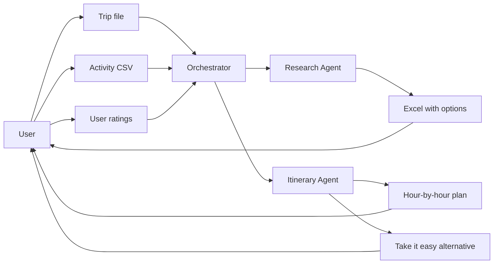

# Product Requirements Document: Itinerary Multi-Agent System

## 1. Overview

This PRD defines a Google ADK (Agent Development Kit) + Gemini multi-agent system that plans full travel itineraries from user inputs. The system accepts a trip info file and a CSV of vague activity preferences, runs a Research agent to find concrete options (output as Excel), and an Itinerary agent to produce hour-by-hour plans with travel buffers, meals, rest, and optional "take it easy" alternatives. Users can run the full flow from the beginning or only the itinerary step with existing files and feedback.

**Tech stack:** Python, Google ADK with Gemini (see [main.py](../main.py) for existing patterns).

---

## 2. User Stories

### 2.1 Trip setup
- **As a** user, **I can** upload a trip info file (country, city, flight information, number of days) **so that** the system knows my trip constraints and can scope research and itinerary to my dates and location.

### 2.2 Activity preferences
- **As a** user, **I can** upload a CSV file with vague activity descriptions and how much I want to do each (e.g. "korea, seoul, salt bread" or "salt bread, seoul") **so that** the system can research concrete options and schedule them in my itinerary.

### 2.3 Research step
- **As a** user, **I can** run the research agent **so that** I get multiple options per activity (e.g. night markets in Seoul) in a clean Excel sheet with addresses and locations for each option.
- **As a** user, **I can** view and optionally provide additional ratings for each row in the research Excel **so that** the itinerary agent can prioritize my preferred options.

### 2.4 Itinerary step
- **As a** user, **I can** run the itinerary agent **so that** I receive an hour-by-hour breakdown including activity, recommended time, meals, travel buffers, and rest times.
- **As a** user, **I can** get alternative "take it easy" plans **so that** I have a lighter schedule option with more rest and fewer activities.

### 2.5 Step selection
- **As a** user, **I can** choose to run from the beginning (trip file + CSV → research → ratings → itinerary) **or** only the itinerary step using existing uploaded files and my feedback **so that** I can iterate on the plan without re-running research.

---

## 3. UI Layout and Components

### 3.1 Layout

- **Structure:** Step-based wizard with clear stages: (1) Upload trip info + CSV, (2) Run research and review Excel, (3) Optionally rate research rows, (4) Run itinerary and view plans.
- **Step selector:** At start, user selects either "Start from beginning" or "Itinerary only (use existing files + feedback)." When "Itinerary only" is selected, the UI shows upload areas as optional (for re-upload) and emphasizes a feedback text area and "Run itinerary" action.
- **Responsive:** Single-column on small screens; side-by-side upload areas and result panels on larger screens where appropriate.

### 3.2 Components

| Component | Description |
|-----------|-------------|
| **Trip info file upload** | File input (e.g. JSON, YAML, or text) for country, city, flight info, days. Accepts one file; shows filename and basic validation state. |
| **Activity CSV upload** | File input for CSV of vague activities and preference levels. Shows row count or preview after parse. |
| **Step mode selector** | Radio or toggle: "Start from beginning" vs "Itinerary only (existing files + feedback)." |
| **Run research button** | Triggers research agent run. Disabled until trip file and CSV are provided (when starting from beginning). Shows loading state during run. |
| **Research results / Excel viewer** | Table or embedded viewer showing research output: activity type, option name, address, location, optional link, and a column for user rating. Supports export/download of the Excel file. |
| **User rating inputs** | Per-row or per-activity controls (e.g. dropdown or number) for user to rate research options. Optional; can submit "no ratings" to use defaults. |
| **Run itinerary button** | Triggers itinerary agent. When "Itinerary only" is selected, accepts optional feedback text. Disabled when required inputs are missing. Shows loading state. |
| **Itinerary day/hour view** | Day-by-day view with hour-by-hour rows: time slot, activity name, location, travel buffer, meal/rest indicators. Expandable per day. |
| **Take it easy toggle / alternative view** | Toggle or tab to switch between "Full plan" and "Take it easy" alternative. Alternative view shows the same structure with fewer activities and more rest/buffers. |
| **Error banner / toast** | Displays validation errors (invalid file, missing fields) and agent/API errors (e.g. rate limit, timeout). Dismissible. |
| **Status / loading indicators** | Inline spinners or skeleton for file upload processing, research run, and itinerary run. Optional progress text (e.g. "Researching activities…"). |

### 3.3 Data display

- **Trip info:** Summary card or list: country, city, flight dates/times (if provided), number of days.
- **Research Excel:** Table with sortable columns; optional filter by activity type. Download button for the generated Excel file.
- **Itinerary:** Timeline or table by day; each day has hourly slots with activity, duration, travel buffer, and meal/rest labels. Export option (e.g. CSV or PDF) for the selected plan (full or take it easy).

---

## 4. State Management

### 4.1 App / session state

- **Client (UI):** Store minimal state needed for the current session: selected step mode, uploaded trip file reference (or parsed trip object), uploaded CSV reference (or parsed activities), research results (or Excel blob/URL), user ratings keyed by row or activity id, itinerary result (full + alternative), and last error message.
- **Backend (ADK session):** Use ADK session state keys to pass data between agents and steps:
  - `trip_info` — Parsed trip info (country, city, flights, days).
  - `activity_csv` / `activity_list` — Parsed list of vague activities and preference levels.
  - `research_results` — Structured research output (options per activity with name, address, location, link).
  - `user_ratings` — User-provided ratings per research row or activity option.
  - `itinerary_plan` — Hour-by-hour plan (full).
  - `itinerary_alternatives` — "Take it easy" variant(s).
  - `step_mode` — "full" or "itinerary_only".
  - `user_feedback` — Free-text feedback when running itinerary only.

### 4.2 User step choice

- Step choice ("start from beginning" vs "itinerary only") is sent with the request (e.g. in request body or query). Backend stores it in session state as `step_mode` and gates which agents run (orchestrator skips research when `itinerary_only` and uses existing `research_results` / `user_ratings` and `user_feedback`).

### 4.3 Persistence

- **In-memory (default):** Use InMemoryRunner / InMemorySessionService so that state is per-session and lost on restart. Suitable for development and single-user demos. Implications: refresh or new tab starts a new session; no cross-device state.
- **Optional persistence:** PRD does not mandate a DB; if added later, document how session state is persisted (e.g. DatabaseSessionService or file-based) and how uploads (trip file, CSV, Excel) are stored and referenced by session id.

---

## 5. API Endpoints

### 5.1 Backend surface

| Method | Endpoint | Description |
|--------|----------|-------------|
| POST | `/api/trip` or `/upload/trip` | Upload trip info file. Returns trip id or parsed summary. |
| POST | `/api/activities` or `/upload/activities` | Upload activity CSV. Returns activity count or parsed list summary. |
| POST | `/api/research/run` | Run research agent. Request: session id, optional trip id + activities id (or inline payload). Response: research job id or synchronous research result. |
| GET | `/api/research/results` | Get research results or Excel file for session. Query: session id. |
| POST | `/api/ratings` | Submit user ratings. Request: session id, ratings payload (row id / activity id → rating). |
| POST | `/api/itinerary/run` | Run itinerary agent. Request: session id, step_mode (`full` or `itinerary_only`), optional feedback text. Response: job id or synchronous itinerary result. |
| GET | `/api/itinerary` | Get itinerary and alternatives. Query: session id. |

If the UI is minimal (e.g. CLI-driven), equivalent CLI subcommands or RPC entrypoints can be documented instead of REST; the same logical operations (upload trip, upload CSV, run research, submit ratings, run itinerary, get results) apply.

### 5.2 Request / response (high-level)

- **Upload trip:** Body: multipart file or JSON with base64 content. Response: `{ "tripId": "...", "country": "...", "city": "...", "days": N }` or error.
- **Upload CSV:** Body: multipart file or JSON. Response: `{ "activityCount": N, "activities": [...] }` or error.
- **Run research:** Body: `{ "sessionId": "...", "tripId": "...", "activitiesId": "..." }` or inline trip + activities. Response: `{ "jobId": "..." }` or `{ "researchResults": [...], "excelUrl": "..." }`.
- **Submit ratings:** Body: `{ "sessionId": "...", "ratings": { "rowId": rating, ... } }`.
- **Run itinerary:** Body: `{ "sessionId": "...", "stepMode": "full" | "itinerary_only", "feedback": "..." }`. Response: `{ "jobId": "..." }` or `{ "itinerary": [...], "alternatives": [...] }`.
- **Get itinerary:** Query: `sessionId`. Response: `{ "itinerary": [...], "alternatives": [...] }`.

### 5.3 Async / long-running

- **Option A (sync):** Run research and itinerary synchronously with a longer timeout; UI shows loading until response. Simple but may hit timeout for large inputs.
- **Option B (async):** Run returns a `jobId`; client polls `GET /api/jobs/{jobId}` or `GET /api/research/results` / `GET /api/itinerary` until ready. Show progress and then results.
- **Option C:** Webhooks for completion (optional); PRD leaves choice to implementation. Document chosen approach in deployment/runbook.

---

## 6. Error and Loading States

### 6.1 Errors

- **Invalid or missing trip file:** Validate format and required fields (e.g. country, city, days). Return 400 with message (e.g. "Missing required field: days"). UI: show error near trip upload, do not clear file input so user can fix and re-submit.
- **Invalid or missing CSV:** Validate CSV structure and at least one activity row. Return 400 with message. UI: show error near CSV upload.
- **Agent failure:** Research or itinerary agent throws or returns error (e.g. tool failure, model error). Return 502 or 503 with generic message and optional correlation id. UI: toast or banner "Something went wrong; please try again."
- **Rate limit (e.g. 429):** Backend should retry with backoff (see existing retry in [main.py](../main.py)); if still failing, return 429. UI: "Too many requests; please wait a moment and try again."
- **Timeout:** Long-running run exceeds server timeout. Return 504. UI: "Request took too long; try fewer activities or try again."
- **Invalid step selection:** E.g. "Itinerary only" but no prior research results for session. Return 400. UI: "Run research first or choose Start from beginning."

### 6.2 Loading

- **File upload:** Disable "Run research" until uploads complete; show spinner or "Processing…" on the upload area after file select.
- **Research run:** Disable "Run research" and show "Researching activities…" with spinner until response.
- **Itinerary run:** Disable "Run itinerary" and show "Building your itinerary…" with spinner until response.
- **Partial results:** If research succeeds but itinerary fails, show research results and error for itinerary; allow user to fix (e.g. add feedback) and re-run itinerary only.

---

## 7. Accessibility Considerations

- **Keyboard navigation:** All interactive elements (file inputs, buttons, toggles, rating controls) reachable and activatable via keyboard (Tab, Enter, Space). No keyboard traps.
- **Focus management:** After upload or after a long run completes, move focus to the result area or next logical action (e.g. "Run itinerary" or first rating input) so screen reader users get immediate feedback.
- **Labels:** All file inputs and buttons have visible or aria-label text (e.g. "Upload trip info file", "Run research"). Research table and itinerary table have proper column headers and row scope so screen readers can announce structure.
- **Contrast and structure:** Use sufficient color contrast for text and controls. Use headings (h1, h2) for wizard steps and sections; use lists or tables for itinerary and research data.
- **Error and status messages:** Associate error messages with inputs (aria-describedby or aria-errormessage) and use live region (aria-live) for status updates (e.g. "Research complete") so they are announced without focus change when appropriate.

---

## 8. Folder Structure

Proposed repository layout aligned with a single frontend deployable to GitHub Pages and a Python backend:

```
itinerary/
├── docs/
│   ├── PRD.md
│   └── IMPLEMENTATION_CHECKLIST.md
├── src/
│   ├── agents/
│   │   ├── __init__.py
│   │   ├── research_agent.py
│   │   ├── itinerary_agent.py
│   │   └── orchestrator.py
│   ├── tools/
│   │   ├── __init__.py
│   │   ├── trip_parser.py
│   │   ├── csv_parser.py
│   │   ├── excel_export.py
│   │   └── travel_time.py
│   ├── api/
│   │   ├── __init__.py
│   │   ├── routes.py
│   │   └── schemas.py
│   └── cli/
│       ├── __init__.py
│       └── main.py
├── frontend/
│   ├── index.html
│   ├── assets/
│   └── (or static export of SPA)
├── tests/
│   ├── unit/
│   │   ├── test_trip_parser.py
│   │   ├── test_csv_parser.py
│   │   └── test_agents.py
│   └── integration/
│       └── test_full_flow.py
├── .github/
│   └── workflows/
│       └── deploy-pages.yml
├── main.py
├── requirements.txt
├── .env.example
└── README.md
```

- **agents:** Research agent, Itinerary agent, and orchestrator (root) that wires step mode and session state.
- **tools:** Trip file and CSV parsing; Excel export for research; travel-time helper (or stub for external API).
- **api:** REST routes and request/response schemas (or equivalent if using FastAPI/Flask).
- **cli:** Optional CLI entrypoint for uploads and run steps.
- **frontend:** Static assets or built SPA for GitHub Pages.
- **tests:** Unit tests for parsers and agents; integration test for full flow.

---

## 9. Deployment Plan for GitHub Pages

### 9.1 Frontend build

- **Option A:** Plain HTML/CSS/JS in `frontend/` with no build step; copy as-is to deployment output.
- **Option B:** Use a framework (e.g. React, Vue) with static export; build output is a folder of static files (e.g. `frontend/dist/` or `frontend/build/`). Configure base URL for GitHub Pages (e.g. `/<repo-name>/` if using project pages).

### 9.2 Publish

- **GitHub Actions:** Add workflow under `.github/workflows/deploy-pages.yml` that triggers on push to `main` (or manual):
  - Checkout repo.
  - Set up Node (if build step) or skip.
  - Build frontend (if applicable).
  - Deploy to GitHub Pages using `actions/upload-pages-artifact` and `actions/deploy-pages`, or push to `gh-pages` branch / `docs` folder depending on repo settings.
- **Manual:** Document steps to run build locally and push `dist` (or `frontend/`) to `gh-pages` branch or to `docs/` for GitHub Pages.

### 9.3 Backend

- The agent backend (Python ADK + Gemini) runs **separately** from GitHub Pages. GitHub Pages serves only the static UI.
- **Options:** Run backend locally for development; deploy to Cloud Run, Google Cloud Functions, or another host for production. Frontend must call a configurable API base URL (e.g. environment variable or config file) so that the same static build can point to local or production backend.
- Document in README or runbook: set `GOOGLE_API_KEY` (and any travel-time API key) in the backend environment; do not expose keys in the frontend.

---

## 10. Agent Architecture

### 10.1 Research agent

- **Input:** Vague activity list derived from CSV and trip context (e.g. city, country). Each item may be incomplete (e.g. "salt bread", "night market Seoul").
- **Tool:** Search (e.g. ADK `google_search` or similar) to find 2–5 concrete options per activity.
- **Output:** Structured list of options per activity: name, address, location/area, optional link. Written to a clean Excel file with columns: activity_query, option_name, address, location, link, user_rating (empty for user to fill). Multiple rows per activity for user to review and rate.

### 10.2 Itinerary agent

- **Input:** Trip info (days, city, flight constraints), selected or rated activities (from research results + user ratings), and optional free-text feedback when step mode is "itinerary only."
- **Tools:** Travel time between locations (e.g. matrix or external API for bus, train, walking, driving); optional slot/calendar logic to fit activities into days and hours.
- **Output:** Hour-by-hour plan: for each day, list of slots with activity, recommended start/end time, travel buffer, meal/rest flags. Plus an alternative "take it easy" plan: fewer activities, more buffers and rest, same structure.

### 10.3 Orchestration

- **Root / orchestrator:** Coordinates flow based on `step_mode`.
  - **Full:** Parse trip file and CSV → run Research agent → produce Excel and store in session state → (user may submit ratings) → run Itinerary agent with trip + research results + ratings → return itinerary + alternatives.
  - **Itinerary only:** Load existing trip, research results, and ratings from session (or from re-uploaded files + feedback); run Itinerary agent with optional feedback → return itinerary + alternatives.
- Session state keys (`trip_info`, `activity_csv`, `research_results`, `user_ratings`, `itinerary_plan`, `itinerary_alternatives`, `step_mode`, `user_feedback`) are read/written by the orchestrator and agents as needed.

### 10.4 Flow diagram



---

*End of PRD. See [IMPLEMENTATION_CHECKLIST.md](IMPLEMENTATION_CHECKLIST.md) for the numbered implementation checklist.*
